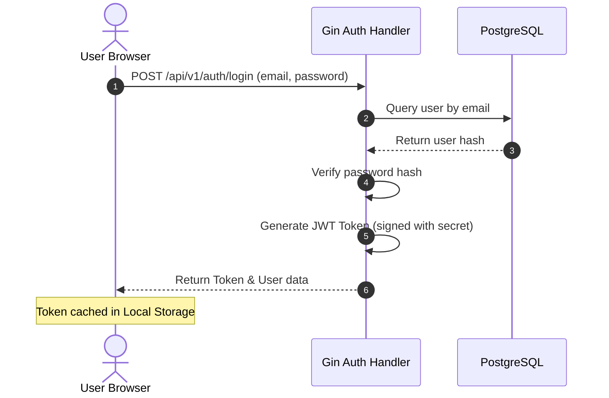
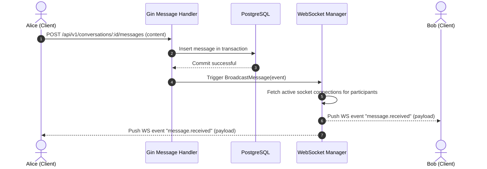
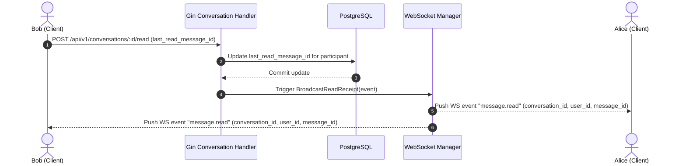
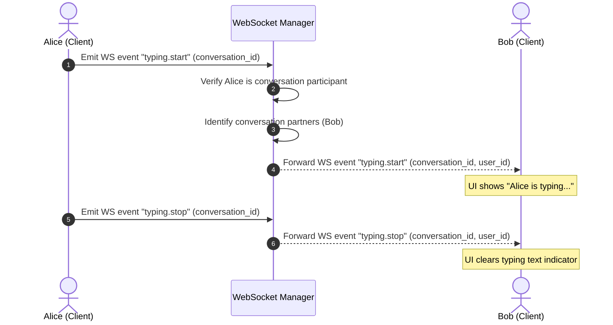

# ChatSphere System Architecture Guide

This document details the system, database, and real-time WebSocket architecture of ChatSphere V1.

---

## 1. System Overview

ChatSphere uses a modular architecture where an Nginx reverse proxy serves as the gateway. It routes static asset requests to the frontend static server, and API/WebSocket requests to the Go API service.

```text
               +--------------------------------------+
               |          Web Browser Client          |
               +--------------------------------------+
                                   |
                      HTTP / WS Traffic (Port 80)
                                   v
               +--------------------------------------+
               |         Nginx Gateway Proxy          |
               +--------------------------------------+
                /                                    \
       Serves Static Assets                    Proxies HTTP / WS
              /                                        \
             v                                          v
+------------------------+                  +------------------------+
|  React Frontend SPA    |                  |    Go API Backend      |
|  (Static Server Files) |                  |    (Port 8080)         |
+------------------------+                  +------------------------+
                                                         |
                                                    ACID SQL Connect
                                                         v
                                            +------------------------+
                                            |  PostgreSQL Database   |
                                            |  (Internal Port 5432)  |
                                            +------------------------+
```

---

## 2. Frontend Architecture (React)

The React client is structured as a Single Page Application (SPA):
- **Vite Bundler**: Compiles code, assets, and styles for optimized production loading.
- **Routing**: Handled by React Router DOM. Secured routes require a valid JWT token.
- **State Management (Zustand)**: Divided into domain-specific stores:
  - `auth-store.ts`      : Handles user profile cache and session states.
  - `conversation-store.ts`: Tracks active conversations lists, search filters, and counters.
  - `message-store.ts`   : Manages messages cached for the active conversation.
  - `presence-store.ts`  : Caches active online status and typing states of partners.
- **API Services**: Axios wrapper automatically attaches the JWT bearer header (`Authorization: Bearer <jwt>`) to all outgoing REST requests.

---

## 3. Backend Architecture (Go)

The Go backend separates concerns using standard clean boundaries:

```text
[Main Entry] (cmd/api/main.go)
     |
     v
[Router Setup] (Gin router, middlewares)
     |
     v
[Handlers] (HTTP request parsing and response rendering)
     |
     v
[Services] (Business logic orchestrations, transaction controls)
     |
     +------> [Repositories] (Raw database SELECT/INSERT/UPDATE)
     |
     +------> [WebSocket Manager] (Real-time socket broadcasts)
```

- **Transaction Manager**: Controls commit/rollback boundaries. It guarantees that database writes are either committed fully or rolled back atomically in case of downstream failures.

---

## 4. Database Architecture (PostgreSQL)

### Table Relationships
```text
+----------------+       +---------------------------+       +-------------------+
|     users      |       | conversation_participants |       |   conversations   |
+----------------+       +---------------------------+       +-------------------+
| id (PK)        |<------| user_id (FK)              |       | id (PK)           |
| name           |       | conversation_id (FK)      |------>| created_at        |
| email          |       | last_read_message_id (FK) |       | updated_at        |
+----------------+       +---------------------------+       +-------------------+
                                       |
                                       v
                               +---------------+
                               |   messages    |
                               +---------------+
                               | id (PK)       |
                               | sender_id (FK)|
                               | content       |
                               +---------------+
```

### Schema Optimization Highlights
- **Composite Index**: To fetch conversation history efficiently, we use a composite index on the messages table:
  `idx_messages_conversation_sent_id ON messages (conversation_id, sent_at DESC, id DESC)`.
- **JSON Aggregation**: The conversation list query uses lateral joins and database-level JSON aggregations (`json_build_object`, `json_agg`) to fetch conversation metadata and participant records in a single query, preventing N+1 roundtrips.

---

## 5. WebSocket Coordination Layout

Active WebSocket connections are managed by a concurrent Hub and event Coordinator:

- **Hub**: Maintains a map of active client connections. Registrations and unregistrations are handled safely using Go channels to avoid race conditions.
- **Client**: Represents an active websocket connection. Reads incoming packets from the socket and writes outgoing packets.
- **Manager**: Intercepts events, updates database states (e.g. online presence status), and maps payloads to outgoing WebSocket channels.

---

## 6. Visual Sequence Flows

### A. Authentication & JWT Validation Flow


### B. Real-Time Message Propagation Flow


### C. Message Read Receipt Flow


### D. Typing Indicator Flow

