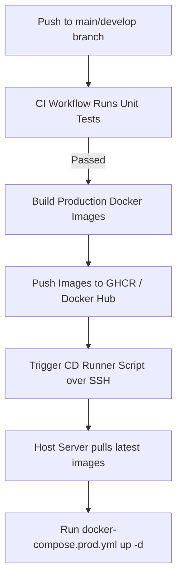

# ChatSphere V1 - Production Deployment Guide

This guide details the procedures for deploying and maintaining ChatSphere V1 in a production environment using Docker Compose.

---

## 1. Prerequisites & Server Provisioning

### Host System Requirements
- **OS**: Ubuntu 22.04 LTS (recommended) or Debian 12.
- **Resources**: Minimum 1 vCPU, 2 GB RAM, 10 GB SSD.
- **Docker**: Engine version 24.0+ and Compose version 2.20+.

### Installing Docker & Compose on Ubuntu
Run the following commands on a clean VPS instance:
```bash
# Update package list and install requirements
sudo apt-get update
sudo apt-get install -y ca-certificates curl gnupg

# Add Docker's official GPG key
sudo install -m 0755 -d /etc/apt/keyrings
curl -fsSL https://download.docker.com/linux/ubuntu/gpg | sudo gpg --dearmor -o /etc/apt/keyrings/docker.gpg
sudo chmod a+r /etc/apt/keyrings/docker.gpg

# Add the repository to Apt sources
echo \
  "deb [arch=$(dpkg --print-architecture) signed-by=/etc/apt/keyrings/docker.gpg] https://download.docker.com/linux/ubuntu \
  $(. /etc/os-release && echo "$VERSION_CODENAME") stable" | \
  sudo tee /etc/apt/sources.list.d/docker.list > /dev/null

# Install Docker Engine and Compose
sudo apt-get update
sudo apt-get install -y docker-ce docker-ce-cli containerd.io docker-buildx-plugin docker-compose-plugin

# Verify installation
docker --version
docker compose version
```

---

## 2. Environment Configurations

1. Clone the repository to your host server's target location (e.g. `/var/www/chatsphere`).
2. Copy the production environment template file:
   ```bash
   cp .env.production.example .env.production
   ```
3. Open `.env.production` in a text editor (e.g. `nano .env.production`) and populate it with secure, unique credentials:
   - Generate strong database passwords: `openssl rand -hex 24`
   - Generate a secure JWT secret: `openssl rand -hex 32`
   - Set the domain endpoints:
     ```env
     VITE_API_URL=https://chat.yourdomain.com/api/v1
     VITE_WS_URL=wss://chat.yourdomain.com/ws
     ```

---

## 3. Production Launch

To build and start the application containers in detached (background) mode:
```bash
docker compose -f docker-compose.prod.yml up -d --build
```

### Verification checks
Confirm all containers are up and running:
```bash
docker compose -f docker-compose.prod.yml ps
```
Access the split health checks from localhost to verify process and database connectivity:
```bash
# Liveness Check (Process running)
curl -i http://localhost:8080/health/live

# Readiness Check (Database connection check)
curl -i http://localhost:8080/health/ready
```

---

## 4. SSL & Nginx Routing Configuration

For simplicity and host safety, the production Docker Compose setup does not contain a Certbot sidecar. We recommend setting up SSL certificates on the VPS host system using Nginx.

### Step 1: Install Nginx and Certbot on the Host
```bash
sudo apt-get update
sudo apt-get install -y nginx certbot python3-certbot-nginx
```

### Step 2: Configure host Nginx Proxy
Create a new configuration block `/etc/nginx/sites-available/chatsphere` containing:
```nginx
server {
    listen 80;
    server_name chat.yourdomain.com;

    location / {
        proxy_pass http://127.0.0.1:80; # Directs to the frontend container
        proxy_set_header Host $host;
        proxy_set_header X-Real-IP $remote_addr;
        proxy_set_header X-Forwarded-For $proxy_add_x_forwarded_for;
        proxy_set_header X-Forwarded-Proto $scheme;
    }
}
```
Enable the site and reload Nginx:
```bash
sudo ln -s /etc/nginx/sites-available/chatsphere /etc/nginx/sites-enabled/
sudo nginx -t
sudo systemctl reload nginx
```

### Step 3: Secure with Let's Encrypt SSL
Run Certbot to fetch and bind SSL certificates:
```bash
sudo certbot --nginx -d chat.yourdomain.com
```
Certbot will configure redirect rules from HTTP to HTTPS automatically, injecting the certificate mappings.

---

## 5. Automated Backups

The project includes database backup and restore scripts located in the `scripts/` directory:
- `scripts/db-backup.sh`: Dumps the compressed PostgreSQL database states to a local `backups/` directory.
- `scripts/db-restore.sh`: Resets and restores the database from a target gzipped sql file.

### Automate Backup Execution (Cron Job)
To automate the backup script to run every night at 2:00 AM:
1. Open the user crontab editor:
   ```bash
   crontab -e
   ```
2. Append the following entry, adapting paths to your actual installation directory:
   ```text
   0 2 * * * /bin/bash /var/www/chatsphere/scripts/db-backup.sh >> /var/log/chatsphere_backup.log 2>&1
   ```
3. Set the script to be executable:
   ```bash
   chmod +x /var/www/chatsphere/scripts/db-backup.sh
   chmod +x /var/www/chatsphere/scripts/db-restore.sh
   ```

---

## 6. Continuous Deployment (CD) Workflow

Even though only Continuous Integration (CI) is implemented in this phase, the future CD workflow is designed as follows:



### Future Automation Flow:
1. **GitHub Repository Secrets**: Add `SSH_PRIVATE_KEY`, `SSH_HOST`, `SSH_USERNAME`, `GHCR_TOKEN` to GitHub Secrets.
2. **CD Steps**:
   - Compiles production Docker images for `backend` and `frontend`.
   - Tags and pushes images to a container registry.
   - Executes an SSH command on the production host server:
     ```bash
     cd /var/www/chatsphere
     git pull origin main
     docker compose -f docker-compose.prod.yml pull
     docker compose -f docker-compose.prod.yml up -d --remove-orphans
     ```
