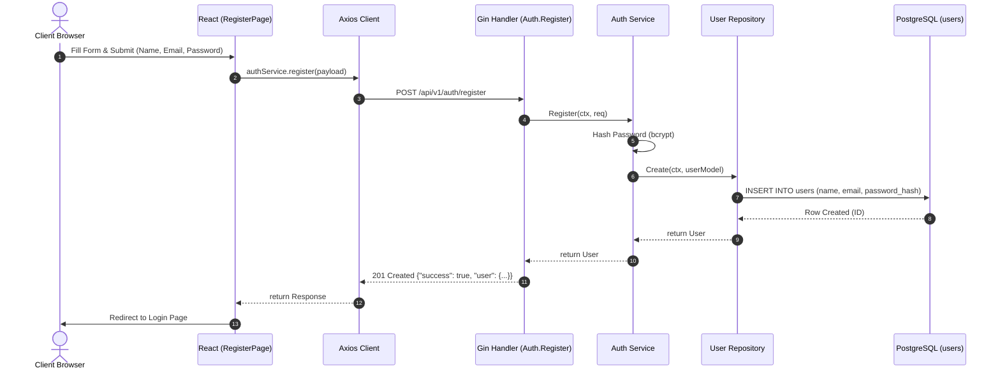
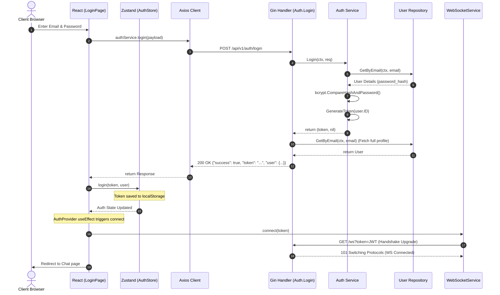
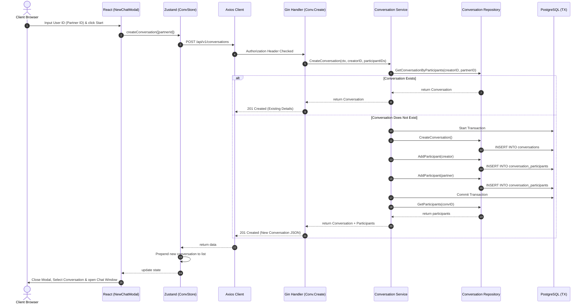
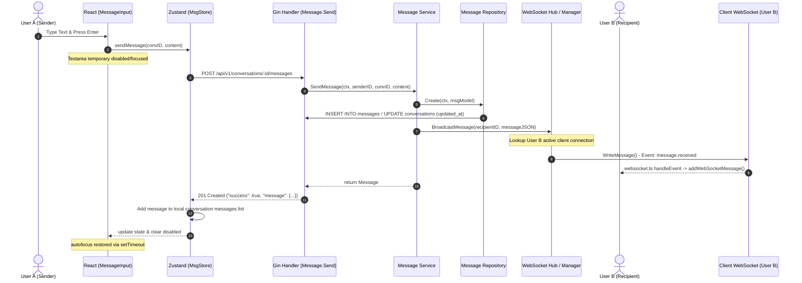
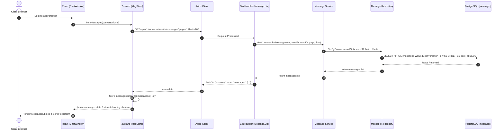
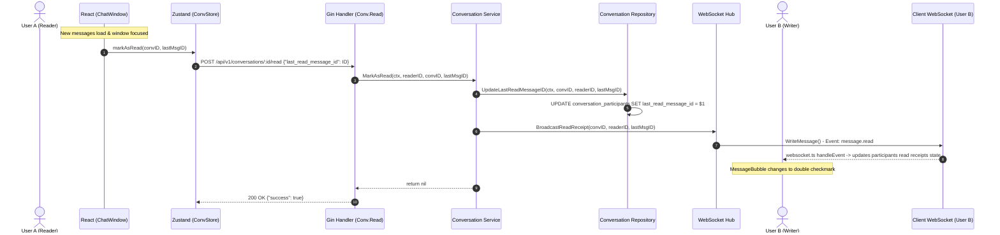
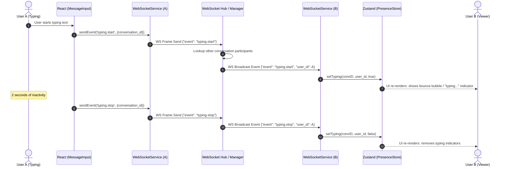
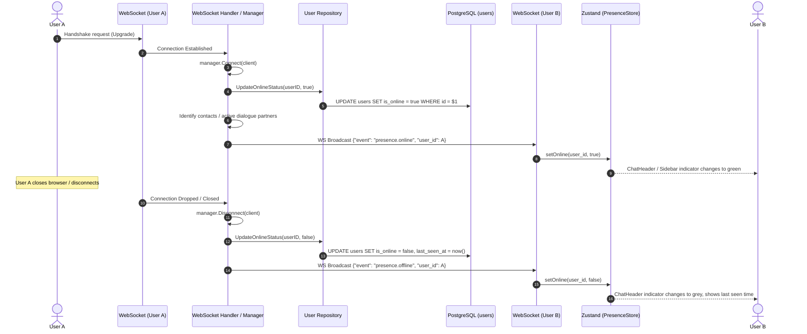

# ChatSphere V1.0.0 Systems Flow & Maintenance Manual

This guide maps the end-to-end flows, architectural components, and debug processes of ChatSphere. It is designed for engineers seeking to maintain, debug, or extend the platform.

---

## 🏗️ Table of Contents
1. [End-to-End System Flow Maps](#1-end-to-end-system-flow-maps)
   - [User Registration](#11-user-registration)
   - [User Login](#12-user-login)
   - [Conversation Creation](#13-conversation-creation)
   - [Sending Messages](#14-sending-messages)
   - [Message Retrieval](#15-message-retrieval)
   - [Read Receipts](#16-read-receipts)
   - [Typing Indicators](#17-typing-indicators)
   - [Presence (Online/Offline)](#18-presence-onlineoffline)
2. [Where to Modify (Feature Extension Playbook)](#2-where-to-modify-feature-extension-playbook)
3. [Common Debugging Paths](#3-common-debugging-paths)

---

## 1. End-to-End System Flow Maps

Each subsection documents the sequence of events across both client and server layers.

### 1.1 User Registration

Handles new user signup with hashed credentials.

* **Frontend Component**: [register-page.tsx](file:///c:/Project/chat-sphere/frontend/src/pages/register-page.tsx)
* **Zustand Store**: [auth-store.ts](file:///c:/Project/chat-sphere/frontend/src/store/auth-store.ts) (Triggered via `register` in [auth-provider.tsx](file:///c:/Project/chat-sphere/frontend/src/features/auth/auth-provider.tsx))
* **Service/API Layer**: `authService.register` in [auth-service.ts](file:///c:/Project/chat-sphere/frontend/src/features/auth/auth-service.ts)
* **Backend Handler**: `AuthHandler.Register` in [handler.go](file:///c:/Project/chat-sphere/backend/internal/auth/handler.go)
* **Backend Service**: `authService.Register` in [service.go](file:///c:/Project/chat-sphere/backend/internal/auth/service.go)
* **Backend Repository**: `userRepo.Create` in [repository.go](file:///c:/Project/chat-sphere/backend/internal/users/repository.go)
* **Database Tables**: `users`
* **WebSocket Events**: None



---

### 1.2 User Login

Authenticates credentials, returns JWT, and establishes the WebSocket connection.

* **Frontend Component**: [login-page.tsx](file:///c:/Project/chat-sphere/frontend/src/pages/login-page.tsx)
* **Zustand Store**: [auth-store.ts](file:///c:/Project/chat-sphere/frontend/src/store/auth-store.ts) (`login` action sets token and user)
* **Service/API Layer**: `authService.login` in [auth-service.ts](file:///c:/Project/chat-sphere/frontend/src/features/auth/auth-service.ts)
* **Backend Handler**: `AuthHandler.Login` in [handler.go](file:///c:/Project/chat-sphere/backend/internal/auth/handler.go)
* **Backend Service**: `authService.Login` in [service.go](file:///c:/Project/chat-sphere/backend/internal/auth/service.go) (verifies bcrypt hash and generates JWT)
* **Backend Repository**: `userRepo.GetByEmail` in [repository.go](file:///c:/Project/chat-sphere/backend/internal/users/repository.go)
* **Database Tables**: `users`
* **WebSocket Events**: None directly during HTTP call. Connects reactively in [auth-provider.tsx](file:///c:/Project/chat-sphere/frontend/src/features/auth/auth-provider.tsx) `useEffect` upon `token` / `isAuthenticated` becoming truthy.



---

### 1.3 Conversation Creation

Finds an existing private chat or initializes a new one.

* **Frontend Component**: [conversation-sidebar.tsx](file:///c:/Project/chat-sphere/frontend/src/features/conversations/conversation-sidebar.tsx) (New Chat Modal)
* **Zustand Store**: [conversation-store.ts](file:///c:/Project/chat-sphere/frontend/src/store/conversation-store.ts) (`createConversation` action)
* **Service/API Layer**: `apiClient.post(ENDPOINTS.CONVERSATIONS.BASE)` in [conversation-store.ts](file:///c:/Project/chat-sphere/frontend/src/store/conversation-store.ts)
* **Backend Handler**: `ConversationHandler.Create` in [handler.go](file:///c:/Project/chat-sphere/backend/internal/conversations/handler.go)
* **Backend Service**: `conversationService.CreateConversation` in [service.go](file:///c:/Project/chat-sphere/backend/internal/conversations/service.go)
* **Backend Repository**: `conversationRepo.GetConversationByParticipants` (duplicate check) -> `conversationRepo.CreateConversation` -> `conversationRepo.AddParticipant` in [repository.go](file:///c:/Project/chat-sphere/backend/internal/conversations/repository.go)
* **Database Tables**: `conversations`, `conversation_participants`
* **WebSocket Events**: None



---

### 1.4 Sending Messages

Submits a message via REST, persists it, and broadcasts it to the recipient in real-time over WebSockets.

* **Frontend Component**: [message-input.tsx](file:///c:/Project/chat-sphere/frontend/src/features/messages/message-input.tsx) -> [chat-window.tsx](file:///c:/Project/chat-sphere/frontend/src/features/messages/chat-window.tsx)
* **Zustand Store**: [message-store.ts](file:///c:/Project/chat-sphere/frontend/src/store/message-store.ts) (`sendMessage` action)
* **Service/API Layer**: `apiClient.post` in [message-store.ts](file:///c:/Project/chat-sphere/frontend/src/store/message-store.ts)
* **Backend Handler**: `MessageHandler.Send` in [handler.go](file:///c:/Project/chat-sphere/backend/internal/messages/handler.go)
* **Backend Service**: `messageService.SendMessage` in [service.go](file:///c:/Project/chat-sphere/backend/internal/messages/service.go)
* **Backend Repository**: `messageRepo.Create` in [repository.go](file:///c:/Project/chat-sphere/backend/internal/messages/repository.go)
* **Database Tables**: `messages`, `conversations` (updates `updated_at` column)
* **WebSocket Events**: `message.received` (Broadcasted by backend to the recipient's connection)



---

### 1.5 Message Retrieval

Retrieves historical messages for a conversation.

* **Frontend Component**: [message-list.tsx](file:///c:/Project/chat-sphere/frontend/src/features/messages/message-list.tsx) (Triggered inside [chat-window.tsx](file:///c:/Project/chat-sphere/frontend/src/features/messages/chat-window.tsx) `useEffect` when selected conversation ID changes)
* **Zustand Store**: [message-store.ts](file:///c:/Project/chat-sphere/frontend/src/store/message-store.ts) (`fetchMessages` action)
* **Service/API Layer**: `apiClient.get` in [message-store.ts](file:///c:/Project/chat-sphere/frontend/src/store/message-store.ts)
* **Backend Handler**: `MessageHandler.List` in [handler.go](file:///c:/Project/chat-sphere/backend/internal/messages/handler.go)
* **Backend Service**: `messageService.GetConversationMessages` in [service.go](file:///c:/Project/chat-sphere/backend/internal/messages/service.go)
* **Backend Repository**: `messageRepo.GetByConversationID` in [repository.go](file:///c:/Project/chat-sphere/backend/internal/messages/repository.go)
* **Database Tables**: `messages`
* **WebSocket Events**: None



---

### 1.6 Read Receipts

Updates a participant's read progress and notifies their chat partner.

* **Frontend Component**: [chat-window.tsx](file:///c:/Project/chat-sphere/frontend/src/features/messages/chat-window.tsx) `useEffect` monitoring `convMessages` list
* **Zustand Store**: [conversation-store.ts](file:///c:/Project/chat-sphere/frontend/src/store/conversation-store.ts) (`markAsRead` action)
* **Service/API Layer**: `apiClient.post` in [conversation-store.ts](file:///c:/Project/chat-sphere/frontend/src/store/conversation-store.ts)
* **Backend Handler**: `ConversationHandler.Read` in [handler.go](file:///c:/Project/chat-sphere/backend/internal/conversations/handler.go)
* **Backend Service**: `conversationService.MarkAsRead` in [service.go](file:///c:/Project/chat-sphere/backend/internal/conversations/service.go)
* **Backend Repository**: `conversationRepo.UpdateLastReadMessageID` in [repository.go](file:///c:/Project/chat-sphere/backend/internal/conversations/repository.go)
* **Database Tables**: `conversation_participants` (`last_read_message_id`)
* **WebSocket Events**: `message.read` (Broadcasted to the other participant)



---

### 1.7 Typing Indicators

Informs a participant when their partner starts or stops typing.

* **Frontend Component**: [message-input.tsx](file:///c:/Project/chat-sphere/frontend/src/features/messages/message-input.tsx) (`handleInputChange` sets timeout, calls `onTyping`) -> [chat-window.tsx](file:///c:/Project/chat-sphere/frontend/src/features/messages/chat-window.tsx)
* **Zustand Store**: None direct. Store [presence-store.ts](file:///c:/Project/chat-sphere/frontend/src/store/presence-store.ts) stores partner typing status reactively when receiving WS events.
* **Service/API Layer**: `webSocketService.sendEvent` in [websocket.ts](file:///c:/Project/chat-sphere/frontend/src/services/websocket.ts)
* **Backend Handler**: `websocket.Manager` in [manager.go](file:///c:/Project/chat-sphere/backend/internal/websocket/manager.go)
* **Database Tables**: None (In-memory WS routing)
* **WebSocket Events**: `typing.start`, `typing.stop` (Bidirectional)



---

### 1.8 Presence (Online/Offline)

Tracks when users connect or disconnect.

* **Frontend Component**: [chat-header.tsx](file:///c:/Project/chat-sphere/frontend/src/features/messages/chat-header.tsx), [conversation-item.tsx](file:///c:/Project/chat-sphere/frontend/src/features/conversations/conversation-item.tsx)
* **Zustand Store**: [presence-store.ts](file:///c:/Project/chat-sphere/frontend/src/store/presence-store.ts) (`setOnline` action)
* **Service/API Layer**: `webSocketService` connection status.
* **Backend Handler**: `websocket.Handler.HandleConnection` in [handler.go](file:///c:/Project/chat-sphere/backend/internal/websocket/handler.go)
* **Backend Service**: `websocket.Manager.Connect` / `Disconnect` in [manager.go](file:///c:/Project/chat-sphere/backend/internal/websocket/manager.go)
* **Backend Repository**: `userRepo.UpdateOnlineStatus` in [repository.go](file:///c:/Project/chat-sphere/backend/internal/users/repository.go)
* **Database Tables**: `users` (`is_online`, `last_seen_at`)
* **WebSocket Events**: `presence.online`, `presence.offline` (Broadcasted by server to active users)



---

## 2. Where to Modify (Feature Extension Playbook)

Guide on how and where to make updates for each feature.

### 2.1 Modifying Registration / Authentication
* **Files to Edit**:
  * [handler.go](file:///c:/Project/chat-sphere/backend/internal/auth/handler.go): Adjust HTTP parameter binding, validation rules, or JSON response models.
  * [service.go](file:///c:/Project/chat-sphere/backend/internal/auth/service.go): Update encryption/decryption models, JWT lifetime length, or validation filters.
  * [repository.go](file:///c:/Project/chat-sphere/backend/internal/users/repository.go): Modify user SQL queries, schema maps, or fields (e.g. adding profile images).
* **Tests to Update**:
  * `backend/internal/auth/auth_test.go`: Add validation cases for custom fields or invalid models.
* **Possible Side Effects**:
  * Changing password encryption parameters (e.g., bcrypt cost factors) can impact CPU usage.
  * Modifications to User structs can break existing table schemas if migrations are not executed concurrently.

### 2.2 Modifying Conversations
* **Files to Edit**:
  * [handler.go](file:///c:/Project/chat-sphere/backend/internal/conversations/handler.go): Modify conversation creation requirements or query limits.
  * [service.go](file:///c:/Project/chat-sphere/backend/internal/conversations/service.go): Adjust participant limits (e.g. extending private chats to support multi-user groups).
  * [repository.go](file:///c:/Project/chat-sphere/backend/internal/conversations/repository.go): Update SQL queries, index usages, or participant retrieval aggregation functions.
* **Tests to Update**:
  * `backend/internal/conversations/conversations_test.go`: Modify mock test scenarios to fit new fields.
* **Possible Side Effects**:
  * Aligns with caching layers; modifying response data format without updating Zustands stores can trigger Javascript crashes (e.g. Hook Order Violations or reading undefined properties).

### 2.3 Modifying Messages / Real-Time Dispatcher
* **Files to Edit**:
  * [handler.go](file:///c:/Project/chat-sphere/backend/internal/messages/handler.go): Handle attachments, file size headers, or media upload structures.
  * [service.go](file:///c:/Project/chat-sphere/backend/internal/messages/service.go): Add safety filters, moderation systems, or translation features.
  * [manager.go](file:///c:/Project/chat-sphere/backend/internal/websocket/manager.go): Update client distribution logic or error callbacks.
* **Tests to Update**:
  * `backend/internal/messages/messages_test.go`: Test new payload fields, sizes, or rates.
* **Possible Side Effects**:
  * High network usage if sending large files directly over WebSocket buffers.
  * DB connection pool depletion if transaction rollbacks are not properly managed.

### 2.4 Modifying Read Receipts / Typing States
* **Files to Edit**:
  * [chat-window.tsx](file:///c:/Project/chat-sphere/frontend/src/features/messages/chat-window.tsx): Tweak the timing of `markAsRead` calls (e.g. only marking as read when the user scrolls to the bottom).
  * [message-input.tsx](file:///c:/Project/chat-sphere/frontend/src/features/messages/message-input.tsx): Adjust typing timeouts (e.g. change the 2000ms idle threshold).
  * [manager.go](file:///c:/Project/chat-sphere/backend/internal/websocket/manager.go): Handle receipt events or coordinate database sync operations.
* **Possible Side Effects**:
  * Network chattiness if typing indicators are sent on every keystroke without a throttle/debounce wrapper.

---

## 3. Common Debugging Paths

Follow these checklists to diagnose issues in local development.

### 3.1 Registration Failures
1. **Network Mismatch Check**:
   * Inspect the browser DevTools Network tab. If `POST /auth/register` returns a `404 Not Found`, verify that `VITE_API_URL` is configured with the `/api/v1` suffix (e.g. `http://localhost:8080/api/v1`).
2. **Database Constraint Violations**:
   * Review `docker logs chatsphere-backend`. Look for postgres unique constraint errors: `duplicate key value violates unique constraint "users_email_key"`.
3. **Database Health**:
   * Run `docker exec -it chatsphere-postgres pg_isready -U postgres` to check if the database is running and accepting connections.

### 3.2 Login Failures
1. **Missing User Data in API Response**:
   * If login succeeds on the network level but the UI shows "Login failed" (due to a React store error), verify that the backend `Login` response returns the complete `user` object alongside the `token`.
2. **Invalid Password Hash (Bcrypt)**:
   * Verify the password match using raw database credentials. The password hash in the `users` table must be a valid Bcrypt hash (prefixed with `$2a$`). If a user was seeded with a plain-text password like `hash`, password comparison will fail.
3. **JWT Secret Configuration**:
   * Confirm that the backend is initialized with the correct `JWT_SECRET` in `.env`.

### 3.3 WebSocket Connection Failures
1. **Host Header / Port Mismatch**:
   * Check browser console warnings. If connection is blocked by a CORS policy, verify that the backend's allowed origins include `http://localhost:5173`.
2. **Token Authentication Rejection**:
   * The WS server expects the JWT token to be passed via query string: `ws://localhost:8080/ws?token=<jwt>`. Inspect `backend/internal/websocket/handler.go` to confirm that the token parser extracts and validates the token correctly.
3. **Proxy Buffering**:
   * If running in production (with Nginx), ensure `nginx.conf` has connection upgrade headers:
     ```nginx
     proxy_set_header Upgrade $http_upgrade;
     proxy_set_header Connection "upgrade";
     ```

### 3.4 Missing Messages / Delivery Gaps
1. **DB Transaction Failures**:
   * Inspect backend logs for transaction abort warnings. If a transaction fails (e.g. due to constraint conflicts), the message is rolled back and will not be saved.
2. **WebSocket Client Tracking**:
   * Check `manager.go` to see if client connections are registered under the correct User ID. If a user is logged in on multiple tabs, verify that the WebSocket manager sends events to all active connections for that User ID.
3. **JSON Unmarshaling Mismatch**:
   * Verify that property casing (CamelCase vs snake_case) matches between Go structs and TypeScript interfaces.

### 3.5 Read Receipt Issues
1. **Receipt Sequence Inversion**:
   * If read receipts are not updating, verify that `last_read_message_id` is only updated to a value greater than the previous `last_read_message_id`. Inverting this check can lead to stale receipts.
2. **Event Broadcast Verification**:
   * Verify that the client receives the `message.read` WebSocket event. If it is sent to the server but not broadcasted back, check the participant list lookup query in the backend's read handler.

### 3.6 Typing Indicator Issues
1. **Focus Loss or Page Crashes**:
   * If the page goes blank when clicking a chat, verify the React console logs for hook order violations. Pointers like `usePresenceStore` must be placed at the very top of `ChatWindow`, before any conditional returns.
2. **State Leakage**:
   * If the typing indicator stays stuck in "typing...", verify that `typing.stop` is sent on textarea blur or input clearance.
